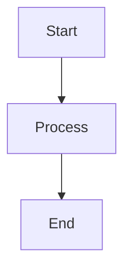
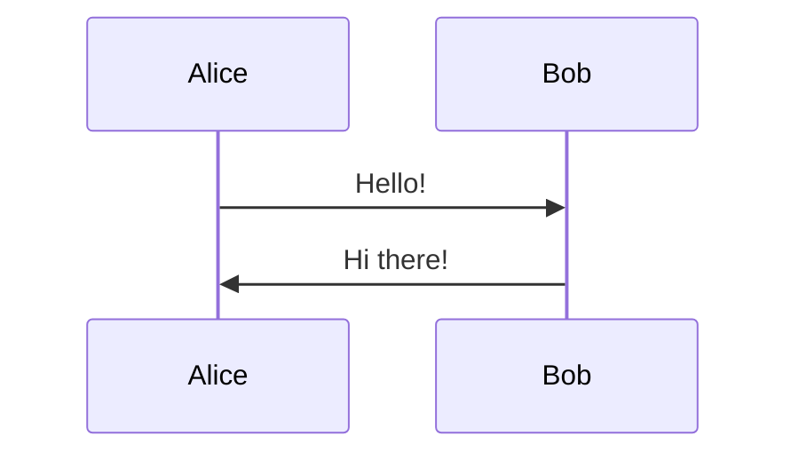

# Medium Articles Converter

Convert Markdown articles with Mermaid diagrams to Medium-ready format with automatic image generation and GitHub hosting.

## Features

✨ **Automatic Mermaid Diagram Conversion**
- Extracts Mermaid diagrams from your Markdown
- Converts them to PNG images via Mermaid Ink API
- Saves images to `/images` directory with descriptive names

📝 **Caption Support**
- Add captions using HTML comments: `<!-- caption: Your caption here -->`
- Automatic figure numbering (Figure 1, Figure 2, etc.)
- Formatted captions in output

🔗 **GitHub Integration**
- Generates GitHub raw URLs for images
- Ready for import into Medium
- Images hosted directly from your public repository

📄 **Dual Output Format**
- Generates both Markdown (.md) and HTML (.html) versions
- HTML version is optimised for Medium import
- Markdown version for other platforms

## Project Structure

```
medium-articles/
├── articles/           # Your original Markdown articles
├── output/            # Converted articles ready for Medium
├── images/            # Generated PNG images from Mermaid diagrams
├── scripts/
│   ├── convert.js     # Main conversion script
│   └── config.js      # Configuration file
├── package.json
├── .gitignore
└── README.md
```

## Setup

### 1. Install Dependencies

```bash
npm install
```

### 2. Configure GitHub Settings

Edit `scripts/config.js` and update:

```javascript
githubUser: 'your-github-username',
githubRepo: 'your-repo-name',
githubBranch: 'main'
```

### 3. Add Your Articles

Place your Markdown articles in the `articles/` directory.

## Usage

### Writing Articles with Mermaid Diagrams

Use this format for diagrams with captions:

```markdown
# My Article Title

Some introduction text...


<!-- caption: Process flow diagram -->

More content here...


<!-- caption: Communication sequence -->
```

**Important:**
- The caption comment must be on the line immediately after the closing triple backticks
- Format: `<!-- caption: Your caption text -->`
- If no caption is provided, it defaults to "Diagram N"

### Running the Converter

```bash
npm run convert
```

The script will:
1. Show you a list of available articles
2. Let you select which one to convert
3. Extract all Mermaid diagrams
4. Generate PNG images in `/images`
5. Create a Medium-ready version in `/output`

### Example Output

**Input (articles/my-article.md):**
```markdown

<!-- caption: Simple flow -->
```

**Output (output/my-article.md):**
```markdown

*Figure 1: Simple flow*
```

## Publishing to Medium

### Step 1: Push to GitHub

```bash
git add .
git commit -m "Add article with diagrams"
git push origin main
```

### Step 2: Import to Medium

**Method 1: Import HTML (Recommended)**

1. Go to Medium → Stories → Import a story
2. Upload or link to the `.html` file from `/output`
3. Medium will automatically format everything

**Method 2: Copy/Paste**

1. Open the `.html` file in your browser
2. Select all (Cmd/Ctrl + A) and copy
3. Paste into Medium's editor

The images will load from your GitHub repository automatically!

## Configuration Options

Edit `scripts/config.js` to customize:

| Option | Description | Default |
|--------|-------------|---------|
| `mermaidTheme` | Diagram theme | `default` |
| `captionPrefix` | Caption text before number | `Figure` |
| `captionStyle` | How captions are formatted | `italic` |
| `imageFormat` | Output image format | `png` |

### Available Mermaid Themes
- `default` - Standard Mermaid theme
- `forest` - Green theme
- `dark` - Dark background
- `neutral` - Minimal styling

## Tips

### Best Practices

1. **Descriptive Captions**: Use clear, descriptive captions for each diagram
2. **Test Locally**: Preview your diagrams at [Mermaid Live Editor](https://mermaid.live/)
3. **Commit Images**: Always commit the generated images before publishing
4. **Version Control**: Keep your original articles in `articles/` for future edits

### Troubleshooting

**Images don't load on Medium:**
- Ensure your repository is public
- Check that images are committed and pushed to GitHub
- Verify the GitHub URLs in the converted file

**Mermaid diagram fails to convert:**
- Test your Mermaid syntax at [Mermaid Live](https://mermaid.live/)
- Check for syntax errors in the diagram
- Ensure the diagram isn't too complex

**Caption not detected:**
- Make sure the comment is directly after the closing ```
- Check the format: `<!-- caption: text -->`
- No blank lines between code block and comment

## Example Article

See `articles/example-article.md` for a complete example with multiple diagrams and captions.

## VS Code Integration

### Recommended Extensions

- **Markdown All in One**: Better Markdown editing
- **Mermaid Preview**: Preview diagrams while writing
- **GitLens**: Better Git integration

### Workspace Settings

Add to `.vscode/settings.json`:

```json
{
  "markdown.preview.breaks": true,
  "markdown.preview.typographer": true,
  "files.associations": {
    "*.md": "markdown"
  }
}
```

## License

MIT

## Contributing

Feel free to submit issues or pull requests!

---

Made with ❤️ for Medium writers who love diagrams
