---

# Mermaid Diagrams for Medium Posts

## Post 1: Remote Desktop Journey

### Diagram 1: The Journey Through Remote Desktop Solutions

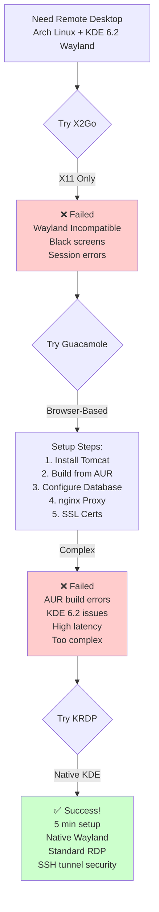

### Diagram 2: KRDP Architecture (Final Solution)

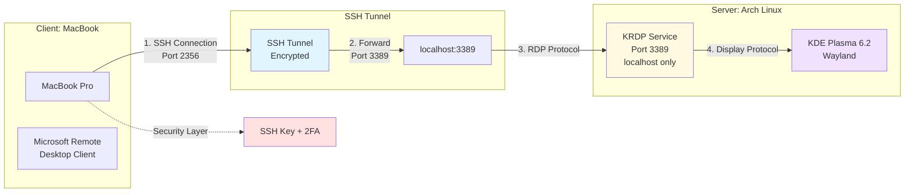

### Diagram 3: Security Layers

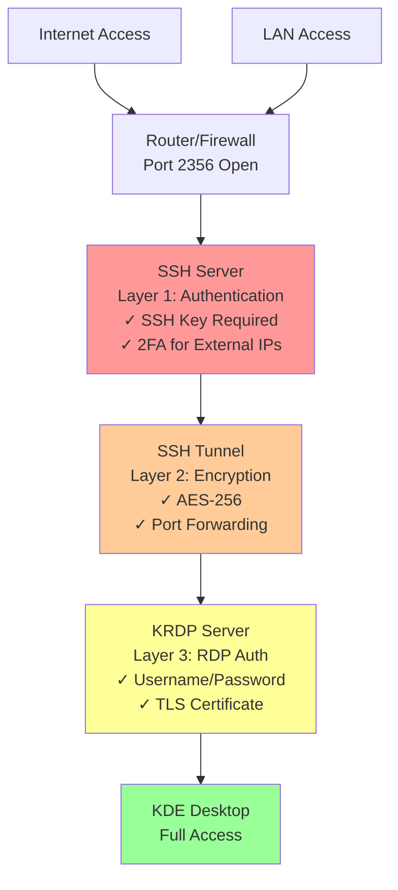

---

## Post 2: Conditional 2FA Architecture

### Diagram 1: Authentication Decision Flow

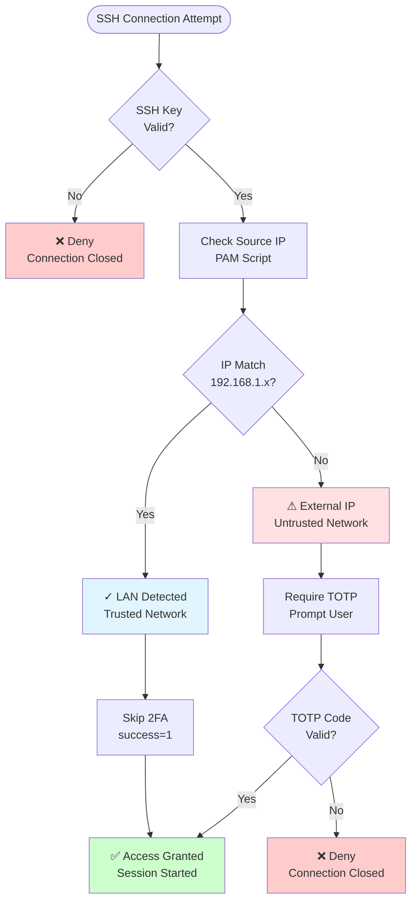

### Diagram 2: LAN vs External Access Comparison

```mermaid
graph TB
    subgraph "LAN Access (192.168.1.x)"
        L1[MacBook on WiFi] -->|1| L2[SSH Key Auth]
        L2 -->|2| L3[IP Check: LAN ✓]
        L3 -->|3| L4[Skip 2FA]
        L4 -->|4| L5[✅ Connected<br/>~50ms total]
    end
    
    subgraph "External Access (Internet)"
        E1[MacBook on 5G] -->|1| E2[SSH Key Auth]
        E2 -->|2| E3[IP Check: External ⚠]
        E3 -->|3| E4[Prompt TOTP]
        E4 -->|4| E5[User Enters Code]
        E5 -->|5| E6[Verify Code]
        E6 -->|6| E7[✅ Connected<br/>~5-10s total]
    end
    
    style L5 fill:#ccffcc
    style E7 fill:#ccffcc
    style L3 fill:#e1f5ff
    style E3 fill:#ffe1e1
```

### Diagram 3: PAM Authentication Flow

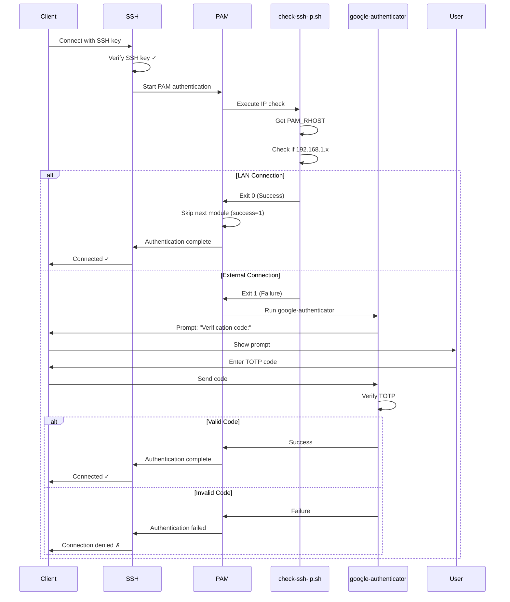

---

## Post 3: Distributed Development Architecture

### Diagram 1: Complete Network Architecture

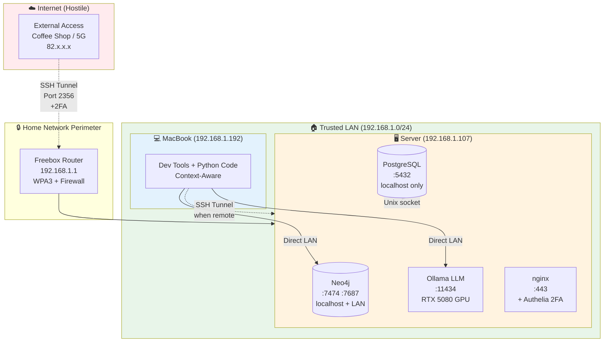

### Diagram 2: Context-Aware Database Access

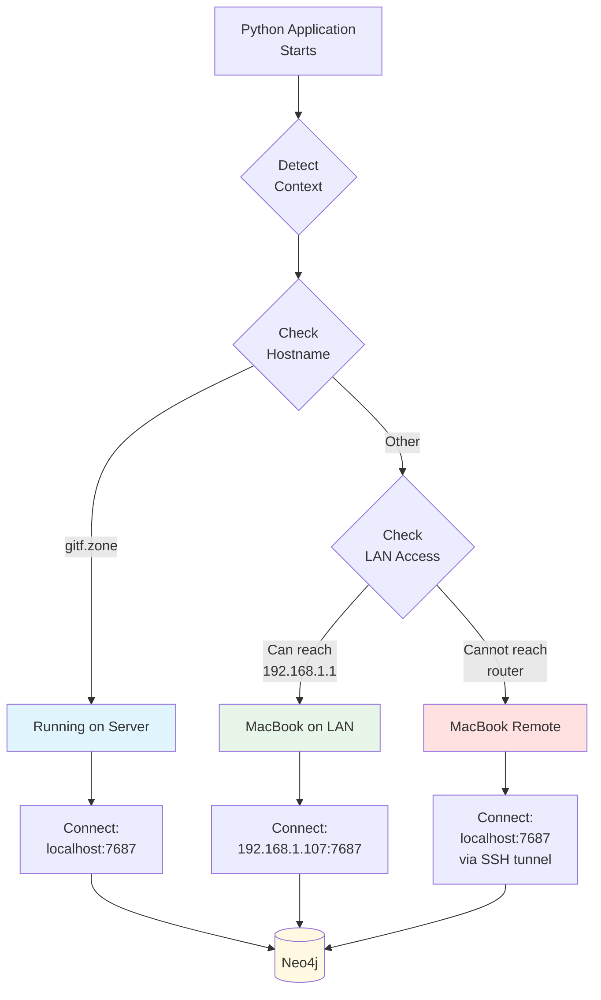

### Diagram 3: Performance Comparison Matrix

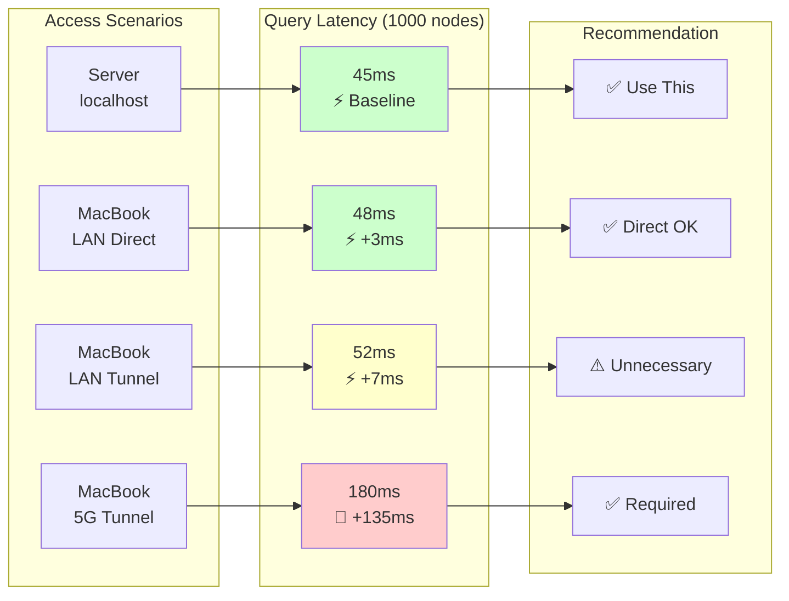

### Diagram 4: Security Layers by Access Type

```mermaid
graph TD
    subgraph "🏠 LAN Access (Trusted)"
        LAN1[MacBook on WiFi] --> LAN2[Direct Connection]
        LAN2 --> LAN3[Neo4j Auth Only]
        LAN3 --> LAN4[Data Access]
        
        LANSec[Security:<br/>✓ WiFi WPA3<br/>✓ Router Firewall<br/>✓ Physical Security<br/>✓ DB Password]
    end
    
    subgraph "☁️ External Access (Untrusted)"
        Ext1[MacBook on Internet] --> Ext2[SSH Tunnel]
        Ext2 --> Ext3[SSH Key + 2FA]
        Ext3 --> Ext4[Encrypted Channel]
        Ext4 --> Ext5[Neo4j Auth]
        Ext5 --> Ext6[Data Access]
        
        ExtSec[Security:<br/>✓ SSH Key Auth<br/>✓ TOTP 2FA<br/>✓ AES Encryption<br/>✓ Tunnel Isolation<br/>✓ DB Password]
    end
    
    subgraph "🌐 Web Access (Public)"
        Web1[Browser] --> Web2[HTTPS]
        Web2 --> Web3[Authelia 2FA]
        Web3 --> Web4[nginx Proxy]
        Web4 --> Web5[Neo4j Browser]
        
        WebSec[Security:<br/>✓ TLS/SSL<br/>✓ TOTP 2FA<br/>✓ Session Mgmt<br/>✓ Rate Limiting<br/>✓ fail2ban]
    end
    
    style LAN1 fill:#e8f5e9
    style Ext1 fill:#fff3e0
    style Web1 fill:#e3f2fd
    style LANSec fill:#c8e6c9
    style ExtSec fill:#ffecb3
    style WebSec fill:#bbdefb
```

### Diagram 5: The Complete Data Flow

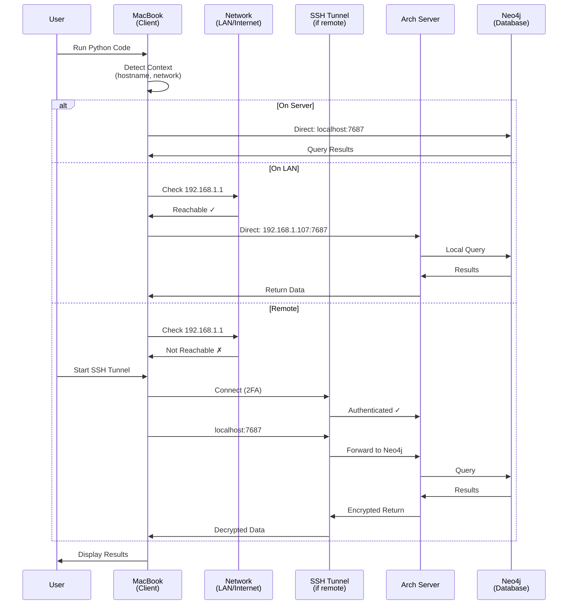

---

## How to Use These Diagrams in Medium

### Option 1: Render as Images
1. Go to https://mermaid.live/
2. Paste each diagram
3. Click "Export" → PNG or SVG
4. Upload to Medium

### Option 2: Use Medium's Code Blocks
Medium doesn't natively support Mermaid, but you can:
1. Include as code blocks with syntax highlighting
2. Add a note: "View interactive diagram at mermaid.live"

### Option 3: GitHub Integration
1. Create a GitHub repo with the diagrams
2. GitHub automatically renders Mermaid
3. Link to the repo from Medium

---

