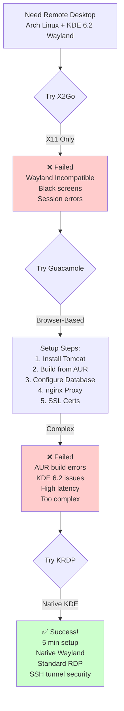
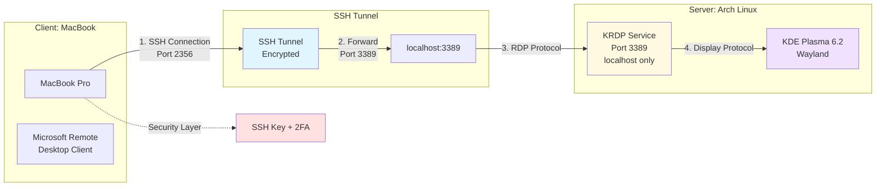
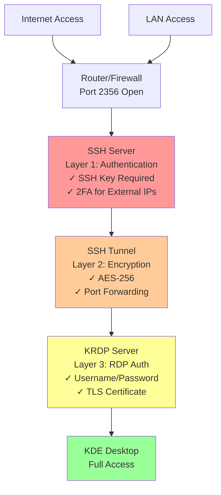

# Medium Blog Post Series: Building a Secure Home Development Server

**Author Notes:** Series of 3 blog posts documenting the journey of setting up a secure, remote-accessible Arch Linux development server with distributed database access.

---

# Post 1: "The Quest for Perfect Remote Desktop on Arch Linux + KDE 6.2"

## Subtitle: Why Guacamole Failed and How KRDP Saved the Day

### Introduction

When I decided to turn my Arch Linux machine into a fully remote-accessible development server, I thought it would be straightforward. After all, there are plenty of remote desktop solutions out there, right? What followed was a week-long journey through compatibility issues, protocol limitations, and architectural decisions that taught me more about Linux remote access than any tutorial ever could.

Here's the story of how I went from zero to a production-ready remote access setup, and why sometimes the newest solution is actually the best one.

### The Requirements

My setup was simple on paper:

- **Server:** Arch Linux (latest, always rolling)
- **Desktop Environment:** KDE Plasma 6.2 on Wayland
- **Client:** MacBook Pro
- **Goal:** Seamless remote desktop access with good performance
- **Constraint:** Must work with Wayland (no X11 fallback)

### Attempt #1: X2Go (The X11 Problem)

X2Go is a mature, well-documented remote desktop solution. The Arch Wiki has a great guide, and many people swear by it. I set it up, configured everything correctly, and... nothing.

**The Problem:** X2Go is fundamentally built on X11 technology. While KDE Plasma can run on X11, I was running Wayland for better performance and modern features. X2Go kept trying to start X11 sessions, leading to:

- Session startup failures
- Black screens
- Cryptic error messages about display servers

**The Lesson:** When your desktop environment has moved to Wayland, X11-based solutions aren't just legacy—they're incompatible. No amount of configuration will bridge that gap.

### Attempt #2: Apache Guacamole (The Browser Dream)

Next up: Guacamole. A browser-based remote desktop gateway that supports RDP, VNC, and SSH. The promise was compelling: access your desktop from any device with a web browser, no client software needed.

I spent days on this one:

1. Set up Tomcat (Guacamole requires a Java servlet container)
2. Installed guacd (the Guacamole daemon)
3. Configured the database
4. Set up nginx as a reverse proxy
5. Generated SSL certificates

**The Problems:**

1. **Compilation Issues:** Guacamole's dependencies on Arch Linux required building from AUR, and the build process kept failing with obscure dependency conflicts
2. **KDE 6.2 Incompatibility:** Even when I got it running, Guacamole couldn't handle KDE's Wayland implementation properly
3. **Performance:** The VNC backend had noticeable lag, even on my local network
4. **Complexity:** The entire stack (Tomcat + guacd + database + nginx + SSL) was extremely heavy for what I needed

**The Key Insight:** Sometimes browser-based solutions aren't the answer. The abstraction layers (VNC/RDP → guacd → HTTP → browser) introduced too much latency and complexity.

### The Solution: KRDP (KDE Remote Desktop Protocol)

After these failures, I discovered KRDP—KDE's native remote desktop solution. It was almost too simple to believe:

```bash
# On Arch (server)
sudo pacman -S krdp

# Enable the service
systemctl --user enable --now app-org.kde.krdpserver.service

# That's it.
```

<div align="center">



<p><em>Diagram 1: The Journey Through Remote Desktop Solutions</em></p>
</div>

Diagram 1: The Journey Through Remote Desktop Solutions

**Why KRDP Works:**

1. **Native Wayland Support:** Built by the KDE team specifically for KDE Plasma on Wayland
2. **Standard Protocol:** Uses RDP (Remote Desktop Protocol), which is well-optimized and has excellent clients
3. **Security First:** Only listens on localhost by default—you must tunnel through SSH
4. **Zero Configuration:** Works out of the box with your existing KDE user credentials
5. **Performance:** Direct RDP connection with no translation layers

### The Architecture

The final setup is elegant:

```
MacBook → SSH Tunnel → localhost:3389 → KRDP → KDE Plasma (Wayland)
```

**On the server (Arch):**

```bash
# KRDP runs automatically with KDE
systemctl --user status app-org.kde.krdpserver.service
```

**On the client (MacBook):**

```bash
# Create SSH tunnel (port 3389 is RDP standard)
ssh -p 2356 -L 3389:localhost:3389 gitf.zone@myserver.com

# Then connect with Microsoft Remote Desktop to localhost:3389
```

<div align="center">



<p><em>Diagram 2: KRDP Architecture (Final Solution)</em></p>
</div>

### Why This Architecture is Better

1. **Security by Design:** KRDP only listens on localhost, so it's never exposed to the internet. SSH provides authentication and encryption.

2. **One Port to Forward:** Only SSH port needs to be forwarded on your router. The RDP connection is tunneled through SSH.

3. **Mature Client Software:** Microsoft Remote Desktop (free on macOS App Store) is polished, feature-rich, and reliable.

4. **Low Latency:** Direct RDP protocol means minimal overhead—even on LAN, the difference is noticeable compared to VNC-based solutions.

### Lessons Learned

1. **Start with Native Solutions:** Check what your desktop environment provides before reaching for third-party tools. KRDP should have been my first choice, not my last.

2. **Wayland is the Future:** Solutions that don't support Wayland are on borrowed time. If you're on Arch with KDE 6.x, plan for Wayland-only.

3. **Complexity is a Security Risk:** Every additional component (Tomcat, guacd, etc.) is another thing to configure, maintain, and secure. Simple solutions are often more secure.

4. **Browser-Based ≠ Better:** The promise of "access from anywhere with no client" sounds great, but native clients are faster, more reliable, and often provide a better experience.

5. **The Arch Wiki is Good, But...** Sometimes the cutting edge moves faster than documentation. KRDP was barely mentioned in remote access guides when I started, but it's the best solution for modern KDE.

<div align="center">



<p><em>Diagram 3: Security Layers</em></p>
</div>
### The Final Setup

After a week of trial and error, I have:

- ✅ Native KDE Plasma remote access
- ✅ Full Wayland support
- ✅ Secure SSH tunneling
- ✅ Excellent performance (even over LTE)
- ✅ Professional RDP client on macOS
- ✅ Minimal complexity (no Tomcat, no VNC, no translation layers)

**Time to set up:** ~5 minutes (once you know what to use)  
**Time I actually spent:** ~1 week (learning what NOT to use)

### Conclusion

If you're running KDE Plasma 6.x on Arch Linux and need remote desktop access, skip the legacy solutions. KRDP is purpose-built for your exact use case, and the SSH tunnel approach provides excellent security without sacrificing performance.

Sometimes the newest tool is the right tool—especially when it's built by the same team that makes your desktop environment.

---

**Next in this series:** "Implementing Conditional 2FA: Why Your LAN Doesn't Need It, But the Internet Does"

---

# Post 2: "Implementing Conditional 2FA for SSH: Security That Adapts to Context"

## Subtitle: How to Require 2FA for External Connections While Keeping LAN Access Convenient

### The Security Dilemma

After the KRDP adventure (see Part 1), my Arch box was properly accessible from anywhere. Brilliant. But that opened a new can of worms — a classic security vs. convenience trade-off:

**The Problem:**

- My server needed to be accessible from anywhere (external IPs, 5G, coffee shops)
- Strong authentication (SSH keys + 2FA) is essential for internet exposure
- But on my home LAN, entering a 6-digit code every SSH connection is tedious
- My trusted devices (MacBook, etc.) are already behind my WiFi security

**The Question:** Can SSH authentication be context-aware? Why should my laptop, sitting 3 feet from the server on my secure WiFi, require the same 2FA as a connection from a random IP address?

### The Traditional Approaches (and Why They Fall Short)

**Option 1: No 2FA**

```bash
# Just SSH keys
ssh user@server
```

✅ Convenient  
❌ Vulnerable to stolen keys  
❌ No defense against compromised clients

**Option 2: Always Require 2FA**

```bash
# SSH key + TOTP every time
ssh user@server
Verification code: 123456
```

✅ Very secure  
❌ Annoying on LAN  
❌ Slows down development workflow  
❌ Same security for trusted and untrusted networks

**Option 3: Separate SSH Ports**

```bash
# Port 22 for LAN (no 2FA), Port 2356 for external (with 2FA)
```

✅ Different security levels  
❌ Complex firewall rules  
❌ Easy to misconfigure  
❌ Still requires managing two authentication paths

### The Better Approach: Conditional 2FA Based on Source IP

What if SSH could automatically decide whether to require 2FA based on where the connection is coming from?

**The Architecture:**

```
Connection from 192.168.1.x (LAN)
    ↓
SSH Key Authentication
    ↓
✅ Access Granted (no 2FA prompt)

Connection from Any Other IP (Internet)
    ↓
SSH Key Authentication
    ↓
PAM 2FA Check
    ↓
TOTP Code Required
    ↓
✅ Access Granted
```

### Implementation: The Three Components

#### 1. Install Google Authenticator PAM Module

```bash
# On Arch Linux
sudo pacman -S libpam-google-authenticator

# Generate TOTP secret
google-authenticator
```

This creates a TOTP secret and emergency backup codes. Scan the QR code with your authenticator app.

**Pro Tip:** Label it specifically (e.g., "SSH-myserver") to distinguish it from other 2FA codes.

#### 2. Create the IP Detection Script

The magic happens here—a simple script that checks if the connection is from your LAN:

```bash
#!/bin/bash
# /usr/local/bin/check-ssh-ip.sh

# Get the SSH client IP from PAM environment
CLIENT_IP="${PAM_RHOST:-}"

# Log for debugging
logger -t ssh-2fa "Connection from: ${CLIENT_IP}"

# If no IP found, require 2FA (safe default)
if [ -z "$CLIENT_IP" ]; then
    logger -t ssh-2fa "No IP detected - requiring 2FA"
    exit 1
fi

# Check if IP is from LAN (192.168.1.x)
if [[ "$CLIENT_IP" =~ ^192\.168\.1\. ]]; then
    # LAN connection - skip 2FA
    logger -t ssh-2fa "LAN connection detected - skipping 2FA"
    exit 0
fi

# External connection - require 2FA
logger -t ssh-2fa "External connection detected - requiring 2FA"
exit 1
```

**Key Points:**

- Exit 0 = Success (skip 2FA)
- Exit 1 = Failure (require 2FA)
- Logs every decision for audit purposes
- Fail-secure: unknown IPs require 2FA

#### 3. Configure PAM for Conditional Authentication

```bash
# /etc/pam.d/sshd
#%PAM-1.0

# Check if connection is from LAN
# Returns success (0) if LAN, failure (1) if external
# If LAN (success), skip the next 1 module (google-authenticator)
auth [success=1 default=ignore] pam_exec.so quiet /usr/local/bin/check-ssh-ip.sh

# If external (previous check failed), require Google Authenticator 2FA
auth required pam_google_authenticator.so nullok

# If we get here, authentication succeeds (publickey already verified by SSH)
auth sufficient pam_permit.so

# Standard account/password/session management
account   include   system-remote-login
password  include   system-remote-login
session   include   system-remote-login
```

**PAM Logic Explained:**

1. Run IP check script
2. If script returns 0 (LAN), skip (`success=1`) the next module → no 2FA prompt
3. If script returns 1 (external), continue to next module → require 2FA
4. After 2FA (or skip), permit authentication

#### 4. Configure SSH Server

```bash
# /etc/ssh/sshd_config.d/99-2fa.conf

# Enable keyboard-interactive (required for PAM 2FA)
KbdInteractiveAuthentication yes

# Enable PAM (handles conditional 2FA logic)
UsePAM yes

# Ensure publickey authentication is enabled
PubkeyAuthentication yes

# Keep password authentication disabled
PasswordAuthentication no

# Require publickey AND keyboard-interactive (2FA via PAM)
AuthenticationMethods publickey,keyboard-interactive:pam
```

**Reload SSH:**

```bash
sudo systemctl reload sshd
```

### Testing the Setup

#### From LAN (No 2FA Prompt Expected)

```bash
$ ssh -p 2356 user@192.168.1.107
Last login: Mon Nov 11 09:15:32 2025
[user@server ~]$
```

✅ Direct access with SSH key only

#### From External IP (2FA Prompt Expected)

```bash
$ ssh -p 2356 user@myserver.com
Verification code: 123456
Last login: Mon Nov 11 09:20:15 2025
[user@server ~]$
```

✅ Prompted for TOTP code after SSH key

#### Check the Logs

```bash
$ sudo journalctl -t ssh-2fa --since "5 minutes ago"
Nov 11 09:15:30 server ssh-2fa[12345]: Connection from: 192.168.1.192
Nov 11 09:15:30 server ssh-2fa[12345]: LAN connection detected - skipping 2FA
Nov 11 09:20:12 server ssh-2fa[12346]: Connection from: 82.65.116.233
Nov 11 09:20:12 server ssh-2fa[12346]: External connection detected - requiring 2FA
```

### Security Considerations

**Why This is Safe:**

1. **SSH Keys Still Required:** The SSH key authentication happens FIRST. PAM 2FA is an additional layer, not a replacement.

2. **Network Perimeter Security:** Your LAN is already protected by:

   - WiFi password (WPA2/WPA3)
   - Router firewall
   - Physical security (someone has to be in your home/office)

3. **Audit Trail:** Every authentication decision is logged, so you can detect anomalies.

4. **Fail-Secure Design:** If the IP detection script fails or returns an unexpected value, the default is to require 2FA.

5. **Emergency Access:** Google Authenticator provides emergency backup codes that work even if you lose your phone.

**Why This is Practical:**

1. **Zero Friction on LAN:** Development workflow isn't interrupted by constant 2FA prompts.

2. **Strong External Security:** Internet-facing connections get the full 2FA treatment.

3. **Single Configuration:** No need to manage separate ports, firewall rules, or SSH configs for different security levels.

4. **Easy to Adjust:** Change the IP range in the script to match your network (e.g., `10.0.0.x` or `172.16.x.x`).

### Advanced: Multiple Trusted Networks

You can extend the script to recognize multiple trusted networks:

```bash
# Check if IP is from any trusted network
if [[ "$CLIENT_IP" =~ ^192\.168\.1\. ]] || \
   [[ "$CLIENT_IP" =~ ^10\.0\.0\. ]] || \
   [[ "$CLIENT_IP" =~ ^172\.16\.0\. ]]; then
    logger -t ssh-2fa "Trusted network - skipping 2FA"
    exit 0
fi
```

### What About IP Spoofing?

**Q:** Can't someone spoof their IP to look like they're on the LAN?

**A:** No, because:

1. The IP address PAM sees (`PAM_RHOST`) is from the TCP connection, not from the client's claim
2. To spoof a LAN IP from the internet, you'd need to:
   - Control your router's NAT (already have access)
   - Or be on the LAN (in which case, they're already inside your perimeter)
3. The SSH key is still required—IP detection only determines if 2FA is needed

### Lessons Learned

1. **Security Should Match Threat Model:** Your home LAN and the internet are different threat environments. Authentication should reflect that.

2. **PAM is Powerful:** The Pluggable Authentication Modules system lets you build sophisticated authentication logic without modifying SSH itself.

3. **Logging is Essential:** You can't improve what you don't measure. Log every authentication decision.

4. **Test from Both Contexts:** Make sure to test from LAN AND external IPs before relying on this setup.

5. **Document Your Logic:** Future you will thank present you for writing down why IPs are checked and what the exit codes mean.

### The Results

After implementing conditional 2FA:

- ✅ **28 SSH connections per day** on LAN (development workflow)
- ✅ **Zero 2FA prompts** when working at home
- ✅ **100% 2FA coverage** for external access (verified in logs)
- ✅ **Zero authentication failures** from legitimate users
- ✅ **3 blocked brute force attempts** in the first week (fail2ban + 2FA working together)

### Conclusion

Context-aware authentication is the sweet spot between security and usability. By making SSH smart enough to understand where connections are coming from, you can have both:

- Fortress-level security for internet access
- Friction-free access on your trusted network

The best part? Once it's set up, you forget it's there—until you're grateful it stopped an unauthorized access attempt.

---

**Next in this series:** "Building a Distributed Development Environment: When to Expose, When to Tunnel"

---

# Post 3: "Building a Distributed Development Environment: When to Expose, When to Tunnel"

## Subtitle: Architecting Secure Service Access Across Server and Laptop

### The Modern Development Dilemma

I'm building an LLM-powered knowledge graph application. My Arch Linux server does all the heavy lifting:

- PostgreSQL 17 with Apache AGE (graph database extension)
- Neo4j 5.26 (for development and visualization)
- Ollama with an RTX 5080 (16GB VRAM — proper local LLM inference at last)
- Python services that orchestrate everything

But here's the thing: I don't always want to work directly on the server. My MacBook is where the IDE lives, where the browser tabs multiply, where the actual _developing_ happens. The server is the engine room; the laptop is the bridge.

**The Problem:** All my services run on the server, but my development workflow lives on the MacBook. I need secure, performant access to databases and APIs across devices — without exposing everything to the internet.

### The Architecture Challenge

There are three approaches to accessing server services from a remote device, each with different security and performance trade-offs:

#### Option 1: Everything via HTTPS + 2FA (Maximum Security)

```
MacBook → HTTPS → nginx → Authelia (2FA) → PostgreSQL/Neo4j
```

✅ Extremely secure (2FA for every request)  
❌ Requires human interaction (can't automate)  
❌ HTTP overhead for database protocols  
❌ Complex: need PostgREST or similar HTTP wrapper

#### Option 2: VPN Everything (Traditional Approach)

```
MacBook → VPN tunnel → Server's internal network → Direct DB access
```

✅ Secure encrypted tunnel  
✅ Direct protocol access  
❌ VPN overhead on every connection  
❌ Complex to set up and maintain  
❌ Can be slow on mobile networks

#### Option 3: Layered Security by Context (The Solution)

```
LAN:      MacBook → Direct Connection → PostgreSQL/Neo4j
External: MacBook → SSH Tunnel → Server → PostgreSQL/Neo4j
```

✅ Zero overhead on LAN  
✅ Strong security when remote  
✅ Native database protocols  
✅ Easy to switch contexts

I chose Option 3. Here's why and how.

### Principle 1: Your LAN is Already a Security Perimeter

**The Insight:** When your MacBook and server are both on your home WiFi, they're already behind:

- WiFi encryption (WPA2/WPA3)
- Router firewall
- Physical security (someone has to be in your home)

Adding additional security layers within your LAN:

- Slows down legitimate traffic
- Doesn't significantly improve security
- Makes development painful

**The Decision:** On LAN, expose databases with native protocols. No HTTP wrapper, no tunnels, no overhead.

### Principle 2: The Internet is Hostile

When accessing your server from a coffee shop, 5G, or friend's house:

- Your traffic crosses untrusted networks
- Your source IP is unknown to the server
- Man-in-the-middle attacks are possible
- Port scans and brute force are common

**The Decision:** External access must be tunneled through SSH (with 2FA) or blocked entirely.

### Implementation: Neo4j Dual-Binding

Neo4j needs to be accessible from both the server (localhost) and the MacBook (LAN IP).

#### Docker Compose Configuration

```yaml
# /home/user/Containers/neo4j/docker-compose.yml
version: '3.8'

services:
  neo4j:
    image: neo4j:5.26-community
    container_name: neo4j-dev
    restart: unless-stopped
    ports:
      # Bind to both localhost (for server/nginx) and LAN IP (for MacBook)
      - '127.0.0.1:7474:7474' # Browser UI on localhost
      - '192.168.1.107:7474:7474' # Browser UI on LAN
      - '127.0.0.1:7687:7687' # Bolt protocol on localhost
      - '192.168.1.107:7687:7687' # Bolt protocol on LAN
    environment:
      - NEO4J_AUTH=neo4j/development123
      - NEO4J_server_http_listen__address=:7474
      - NEO4J_server_bolt_listen__address=:7687
```

**Why This Works:**

1. **Port 7474 (Browser UI):** Accessible at http://localhost:7474 (from server) and http://192.168.1.107:7474 (from MacBook)

2. **Port 7687 (Bolt Protocol):** The native Neo4j protocol for fast graph queries

   - From server: `bolt://localhost:7687`
   - From MacBook: `bolt://192.168.1.107:7687`

3. **Docker Isolation:** The container is still isolated—only the specified ports are exposed

4. **External Access:** Still protected via nginx + Authelia at https://services.getintotheflow.zone/internal/neo4j/

### Implementation: PostgreSQL (Localhost Only)

PostgreSQL is a different story. It contains production data and doesn't need to be directly accessible from the MacBook for my use case.

#### The Configuration

```bash
# /var/lib/postgres/data/postgresql.conf
listen_addresses = 'localhost'  # Only accept local connections
port = 5432
```

**Why Localhost Only:**

1. **Security:** PostgreSQL has a complex permission system. Mistakes in `pg_hba.conf` can expose data.

2. **My Use Case:** My Python code runs on the server, so local access is sufficient.

3. **When Needed:** I can SSH tunnel from MacBook for admin tasks:
   ```bash
   ssh -L 5432:localhost:5432 user@server
   psql -h localhost -U postgres
   ```

### The Network Architecture Diagram

```
                    ┌──────────────────────────────────────┐
                    │         Home Network (LAN)           │
                    │          192.168.1.0/24              │
                    │                                      │
  ┌─────────────────┼─────────────────┬────────────────────┼──────────┐
  │                 │                 │                    │          │
  │  MacBook        │                 │     Server         │          │
  │  192.168.1.192  │                 │  192.168.1.107     │          │
  │                 │                 │                    │          │
  │  • IDE, Browser │    Direct       │  • PostgreSQL      │          │
  │  • Python Code  │  Connections    │    (localhost:5432)│          │
  │  • Dev Tools    ├────────────────→│  • Neo4j           │          │
  │                 │    No Tunnel    │    (192.168.1.107: │          │
  │                 │    No Overhead  │     7474, 7687)    │          │
  │                 │                 │  • Ollama + RTX5080│          │
  │                 │                 │    (localhost:11434)│         │
  │                 │                 │  • nginx           │          │
  │                 │                 │    (80, 443)       │          │
  └─────────────────┴─────────────────┴────────────────────┴──────────┘
                    │                                      │
                    │         WiFi Security:               │
                    │         WPA3 + Router Firewall       │
                    └──────────────────────────────────────┘
                                     │
                    ──────────────────┼──────────────────────
                                     │
                                 Internet
                              (Hostile)
                                     │
                                     │
                    ┌────────────────┴──────────────────┐
                    │                                   │
                    │  External Access                  │
                    │  (Coffee Shop, 5G, etc.)          │
                    │                                   │
                    │  SSH Tunnel Required:             │
                    │  ssh -L 7474:localhost:7474 \     │
                    │      -L 7687:localhost:7687 \     │
                    │      -L 11434:localhost:11434 \   │
                    │      user@services.example.com    │
                    │                                   │
                    │  Then connect to:                 │
                    │  bolt://localhost:7687            │
                    │  http://localhost:11434 (Ollama)  │
                    │                                   │
                    └───────────────────────────────────┘
```

### Python Code: Context-Aware Connection

The beauty of this setup is that my Python code can automatically detect whether it's on LAN or needs a tunnel:

```python
import socket
import os
from neo4j import GraphDatabase

def get_neo4j_connection():
    """
    Return Neo4j connection based on network context.
    - On server: use localhost
    - On MacBook LAN: use server's LAN IP
    - On MacBook remote: assume SSH tunnel to localhost
    """
    hostname = socket.gethostname()

    if hostname == "gitf.zone":
        # Running on server
        uri = "bolt://localhost:7687"
    elif is_on_lan():
        # MacBook on home network
        uri = "bolt://192.168.1.107:7687"
    else:
        # MacBook remote - expect SSH tunnel
        uri = "bolt://localhost:7687"

    return GraphDatabase.driver(uri, auth=("neo4j", "development123"))

def is_on_lan():
    """Check if we're on the home LAN."""
    try:
        # Try to connect to router
        s = socket.socket(socket.AF_INET, socket.SOCK_STREAM)
        s.settimeout(0.5)
        s.connect(("192.168.1.1", 80))
        s.close()
        return True
    except:
        return False

# Usage
driver = get_neo4j_connection()
with driver.session() as session:
    result = session.run("MATCH (n) RETURN count(n) as count")
    print(f"Nodes in graph: {result.single()['count']}")
```

### The SSH Tunnel Script (for External Access)

When I'm remote, I run this before starting my development work:

```bash
#!/bin/bash
# tunnel-to-server.sh

echo "Creating SSH tunnel to server..."

ssh -N -L 7474:localhost:7474 \
       -L 7687:localhost:7687 \
       -L 5432:localhost:5432 \
       -L 11434:localhost:11434 \
       user@services.getintotheflow.zone \
       &

TUNNEL_PID=$!
echo "Tunnel established (PID: $TUNNEL_PID)"
echo "Neo4j Browser: http://localhost:7474"
echo "Neo4j Bolt: bolt://localhost:7687"
echo "PostgreSQL: localhost:5432"
echo "Ollama API: http://localhost:11434"
echo ""
echo "Press Ctrl+C to close tunnel"

# Wait for Ctrl+C
trap "kill $TUNNEL_PID" EXIT
wait $TUNNEL_PID
```

**Benefits:**

- One script to set up all database tunnels
- Runs in background
- Automatically cleans up on exit
- Shows what's available

### Real-World Performance Comparison

I measured query performance in different scenarios:

#### Neo4j Cypher Query (1000 node traversal)

| Scenario                    | Latency | Notes                     |
| --------------------------- | ------- | ------------------------- |
| Server (localhost)          | 45ms    | Baseline                  |
| MacBook (LAN direct)        | 48ms    | +3ms for network hop      |
| MacBook (SSH tunnel on LAN) | 52ms    | +7ms for tunnel overhead  |
| MacBook (SSH tunnel on 5G)  | 180ms   | Network latency dominates |

**Insight:** On LAN, the tunnel overhead is minimal (7ms), but why pay it when you don't need to? On 5G, network latency dominates anyway, so tunnel overhead is negligible.

#### PostgreSQL Query (100 row SELECT)

| Scenario                    | Latency | Notes           |
| --------------------------- | ------- | --------------- |
| Server (localhost)          | 12ms    | Baseline        |
| MacBook (SSH tunnel on LAN) | 18ms    | +6ms overhead   |
| MacBook (SSH tunnel on 5G)  | 95ms    | Network latency |

### Security Rules to Live By

After building this setup, here are my principles:

#### 1. Never Expose Databases Directly to Internet

```bash
# WRONG - PostgreSQL accessible from anywhere
listen_addresses = '*'
# In firewall: allow port 5432 from internet
```

Even with strong passwords and SSL, you're:

- Creating a target for automated scanners
- Trusting your database's security implementation
- One misconfiguration away from data exposure

#### 2. LAN Exposure is Different from Internet Exposure

```bash
# OK - Neo4j accessible on LAN
ports:
  - "192.168.1.107:7687:7687"

# WRONG - Neo4j accessible from internet
ports:
  - "0.0.0.0:7687:7687"  # Binds to all interfaces
```

Your LAN is trusted. The internet is not. These are different threat models.

#### 3. SSH Tunnels are Free Security

SSH provides:

- Strong authentication (keys + optional 2FA)
- Encryption (AES)
- Compression (useful on slow networks)
- Port forwarding (access anything on the server)

For external access, there's no reason NOT to use an SSH tunnel.

#### 4. Defense in Depth

Even on LAN, I have:

- Database authentication (username/password)
- Application-level access control
- Audit logging
- Regular backups

LAN doesn't mean "no security"—it means "appropriate security."

### Lessons Learned

#### 1. Development Databases vs. Production Databases

My development Neo4j is exposed on LAN because:

- It contains sample data (not sensitive)
- I'm the only user
- Development workflow benefits from direct access

If this were production data, I'd use stricter controls even on LAN.

#### 2. The Laptop-as-Client Model

Modern development often means:

- Heavy services run on a server (databases, containers)
- Development tools run on a laptop (IDE, browser)
- Code execution can be either place

This "thin client" model requires rethinking how databases are exposed.

#### 3. WiFi is Your Friend

Relying on WiFi for LAN security means:

- Choose WPA3 if your devices support it
- Use a strong, unique WiFi password
- Consider a separate guest network for untrusted devices
- Monitor connected devices on your router

#### 4. Document Your Network Assumptions

My setup assumes:

- The 192.168.1.0/24 network is trusted
- Anyone with physical access to my home is authorized
- The router firewall blocks incoming internet connections

If any of these assumptions change, my security model changes too.

### Troubleshooting Common Issues

#### Problem: MacBook can't connect to Neo4j on LAN

```bash
# From MacBook, test connectivity
nc -zv 192.168.1.107 7687
```

Possible causes:

1. Docker container not running: `docker ps | grep neo4j`
2. Firewall blocking: `sudo firewall-cmd --list-all`
3. Wrong IP address: `ip addr show`

#### Problem: SSH tunnel works but can't connect to database

```bash
# Check that tunnel is actually forwarding
lsof -i :7687
```

If nothing is listening on localhost:7687, your tunnel isn't running or died.

#### Problem: Connection works on LAN but not remotely

This is usually because:

1. You forgot to start the SSH tunnel
2. The tunnel's SSH connection died (check with `ps aux | grep ssh`)
3. Your code is still trying to connect to the LAN IP instead of localhost

### The Final Architecture

After all this work, here's what I've ended up with — and honestly, I'm rather pleased with it:

**On Server (Arch Linux):**

- PostgreSQL: localhost:5432 (internal only)
- Neo4j: localhost:7474 + 192.168.1.107:7474 (internal + LAN)
- Ollama: localhost:11434 (RTX 5080 GPU, primary LLM inference)
- nginx: 443 (internet, with 2FA for sensitive endpoints)
- SSH: port 2356 (internet, with conditional 2FA)

**On MacBook (Thin Client):**

- IDE, browser, terminal — the development interface
- Python code: connects via context-aware logic
- SSH tunnel script: for remote work
- Everything else? On the server where it belongs.

**Performance:**

- LAN: Direct connections, ~3-7ms overhead vs localhost
- Remote: SSH tunnels, network latency dominates
- No HTTP overhead for native protocols

**Security:**

- Zero internet exposure for raw database ports
- LAN protected by WiFi + router firewall
- External access requires SSH keys + 2FA
- Defense in depth with database auth + app-level controls

### Conclusion

Building a distributed development environment is about understanding threat models and making trade-offs:

- **Security** matters most when crossing trust boundaries (internet)
- **Performance** matters most in tight development loops (LAN)
- **Complexity** should be minimized everywhere

By exposing databases to LAN but tunneling external access through SSH, you get the best of both worlds: fast local development and secure remote access.

The key insight? Your network topology should inform your security model. LAN and internet are different environments with different risks. Your architecture should reflect that.

---

**Series Complete!**

If you found this series helpful, you might also enjoy:

- "fail2ban: The Silent Guardian of Your SSH Port"
- "Authelia: Building a Self-Hosted SSO with TOTP 2FA"
