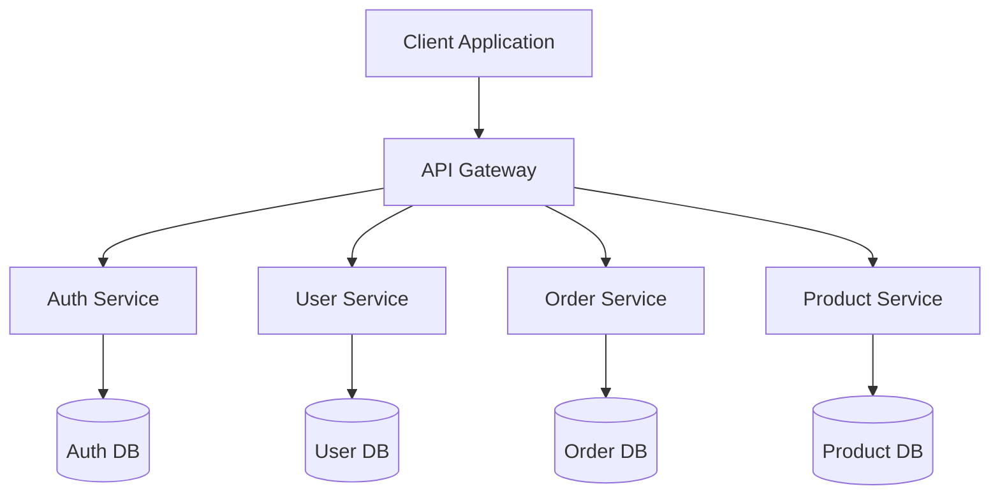
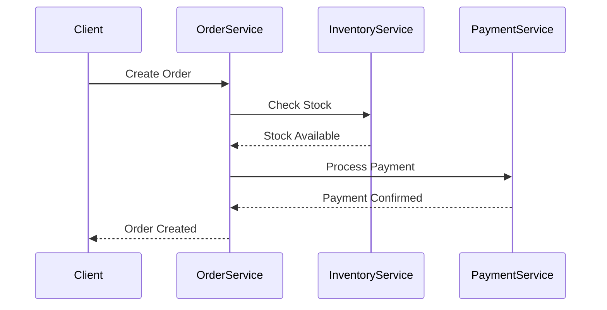
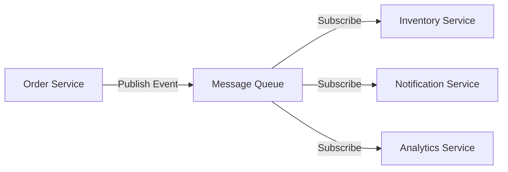
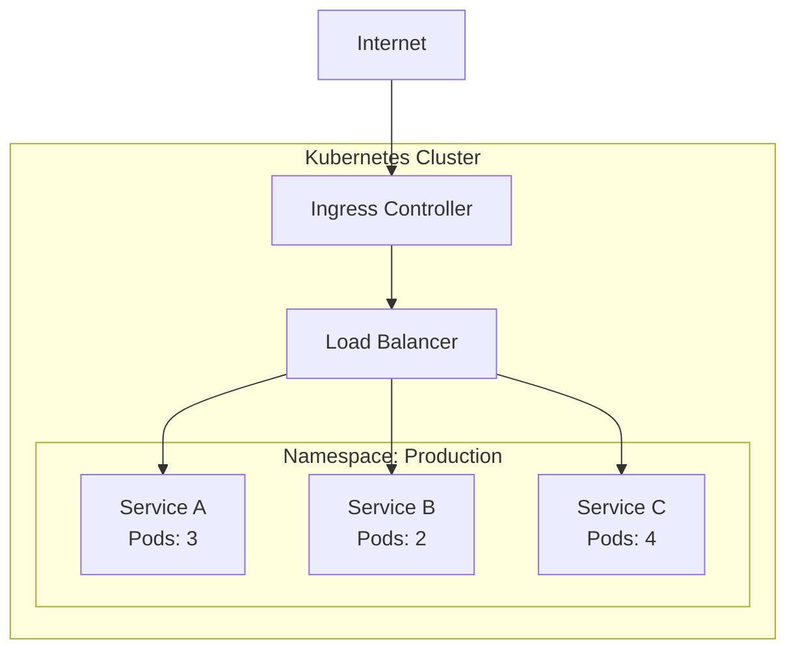

# Understanding Microservices Architecture

Microservices architecture has become increasingly popular for building scalable and maintainable applications. This article explores the key concepts and patterns.

## What are Microservices?

Microservices are an architectural style that structures an application as a collection of loosely coupled services. Each service is self-contained and implements a specific business capability.

## Basic Architecture

Here's a simplified view of a microservices architecture:

<!-- caption: Microservices architecture with API gateway pattern -->

As shown above, each service has its own database, promoting data independence and service autonomy.

## Communication Patterns

Services need to communicate with each other. There are two main patterns:

### Synchronous Communication

<!-- caption: Synchronous request-response communication flow -->

### Asynchronous Communication

<!-- caption: Event-driven asynchronous communication -->

## Deployment Strategy

Modern microservices are often deployed using containers and orchestration platforms:

<!-- caption: Container orchestration deployment model -->

## Key Benefits

1. **Scalability**: Scale individual services based on demand
2. **Resilience**: Failure in one service doesn't bring down the entire system
3. **Technology Diversity**: Use different technologies for different services
4. **Team Autonomy**: Different teams can work on different services independently

## Challenges to Consider

While microservices offer many benefits, they also introduce complexity in areas such as:

- Distributed system complexity
- Data consistency
- Testing and monitoring
- Network latency

## Conclusion

Microservices architecture provides a powerful approach to building modern applications, but it requires careful planning and the right tooling to implement successfully.

The patterns and practices shown in the diagrams above represent common approaches, but every organization must adapt them to their specific needs and constraints.
