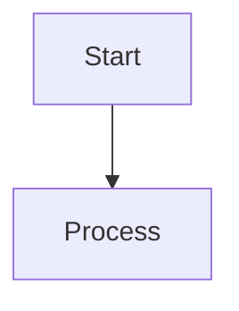
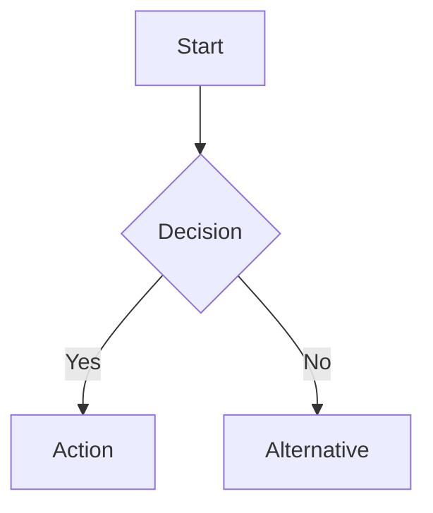
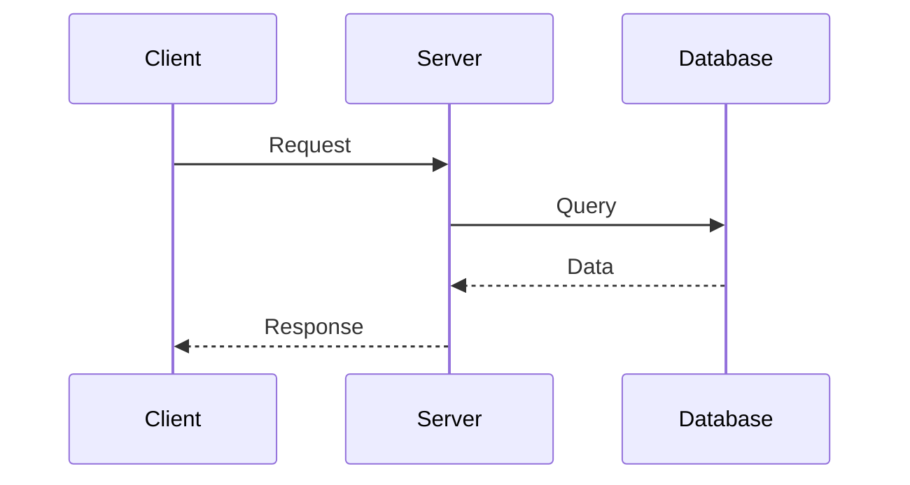
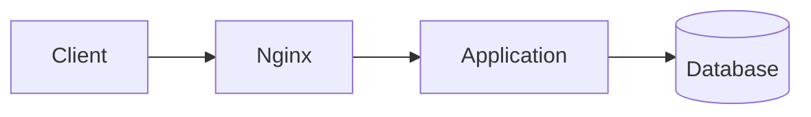
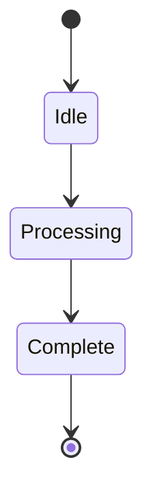

# Medium - Repo-Specific Claude Instructions

For global instructions, see `.claude/claude.md`.


## Project Overview

This repository contains a Markdown-to-Medium converter that handles Mermaid diagrams automatically. Articles are written in Markdown with embedded Mermaid diagrams, then converted to Medium-ready HTML with hosted diagram images.

## Repository Structure

```
Medium/
├── articles/          # Source Markdown files with Mermaid diagrams
├── output/           # Converted files (MD + HTML) ready for Medium
├── images/           # Generated PNG images from Mermaid diagrams
├── scripts/
│   ├── convert.js    # Main conversion script
│   └── config.js     # Configuration (GitHub URLs, themes, etc.)
└── .claude/          # This directory - Claude AI context
```

## GitHub Configuration

- **User:** `gitf-zone`
- **Repo:** `Medium`
- **Branch:** `main`
- **Images:** Hosted via GitHub raw URLs for Medium import

## Mermaid Diagram Best Practices

### Syntax and Structure

When writing Mermaid diagrams for this project, follow these guidelines:

#### 1. **Always Include Captions**

Every Mermaid diagram MUST have a caption comment after the closing backticks:

```markdown

<!-- caption: Your descriptive caption here -->
```

**Rules:**
- Caption should be close to the closing ``` (blank lines are OK - VSCode formatters often add them)
- Format: `<!-- caption: Your text -->`
- The regex handles whitespace flexibly: `[\s\S]*?` captures any spacing between ``` and caption
- Be descriptive - captions become figure labels

#### 2. **Diagram Centering in HTML Output**

The converter automatically:
- Wraps diagrams in `<figure>` tags with inline styles (semantic HTML)
- Centers images with inline centering styles
- Adds captions via `<figcaption>` (may populate Medium's caption field)
- Includes `alt` and `title` attributes on images (for Medium's native caption)
- Uses inline CSS with `!important` for maximum Medium compatibility

**Generated HTML structure:**
```html
<figure style="text-align: center !important; margin: 2.5em auto; padding: 0; max-width: 100%;">
  
  <figcaption style="text-align: center !important; font-style: italic; color: #666; font-size: 0.85em; line-height: 1.4; margin: 0 auto; padding: 0; display: block;">
    Figure 1: Caption text
  </figcaption>
</figure>
```

**Caption strategy:**
- Uses semantic `<figure>` and `<figcaption>` tags (Medium may recognize these)
- Adds `alt` attribute (accessibility and Medium caption field)
- Adds `title` attribute (additional hint for Medium's caption field)
- Includes visible `<figcaption>` text (fallback if Medium strips it)
- All styles are inline with `!important` to override Medium's CSS

#### 3. **Diagram Types and When to Use Them**

**Flowcharts (graph)** - Process flows, decision trees


**Sequence Diagrams** - Communication flows, API interactions


**Architecture Diagrams (graph LR/TB)** - System architecture


**State Diagrams** - State machines, workflows


#### 4. **Medium-Specific Considerations**

- **Keep diagrams simple:** Complex diagrams may not render well at Medium's column width
- **Use clear labels:** Medium readers scan quickly - make nodes descriptive
- **Test responsiveness:** Diagrams should be readable at ~700px width
- **Limit nesting:** Deeply nested structures become hard to read on mobile

#### 5. **Color Themes**

Available in `config.js`:
- `default` - Standard Mermaid (recommended for Medium)
- `forest` - Green theme
- `dark` - Dark background (avoid for Medium)
- `neutral` - Minimal styling

**Current setting:** `default` (best for Medium's light interface)

#### 6. **Medium-Specific HTML Quirks (IMPORTANT!)**

Medium's editor aggressively strips HTML tags and CSS. The converter handles these quirks:

**Problem 1: Captions disappear**
- **Cause:** Medium strips `<figure>` and `<figcaption>` tags
- **Solution:** Use `<div>` + `<p>` with inline styles instead
- **Status:** ✅ Fixed in converter

**Problem 2: List numbering skips (1, 2, 4, 6...)**
- **Cause:** `marked` wraps multi-line list items in `<p>` tags, Medium adds extra spacing
- **Solution:** Post-process to remove `<p>` tags inside `<li>` elements
- **Status:** ✅ Fixed in converter (regex removes `<li><p>` and `</p></li>`)

**Problem 3: CSS doesn't apply**
- **Cause:** Medium strips `<style>` tags and class-based CSS
- **Solution:** Use inline `style=""` attributes on each element
- **Status:** ✅ All critical styles are inline

## Workflow

### Writing Articles

1. Create `.md` file in `articles/` directory
2. Write content with embedded Mermaid diagrams
3. Add captions using `<!-- caption: text -->` format
4. Run converter to generate output

### Converting to Medium Format

```bash
npm run convert
```

The script will:
1. Prompt for article selection
2. Extract Mermaid diagrams
3. Generate PNG images via Mermaid Ink API
4. Save images to `images/` directory
5. Create both `.md` and `.html` versions in `output/`
6. Generate GitHub-hosted image URLs

### Publishing to Medium

**Method 1: Copy HTML (Recommended for Manual Publishing)**
1. Open `output/[article-name].html` in browser
2. Select All (Cmd/Ctrl + A) and copy
3. Paste into Medium editor
4. Images load automatically from GitHub

**Method 2: Medium API (Currently Unavailable)**
- Previously available via `npm run publish`
- Created drafts directly on Medium
- Currently troubleshooting API access issues

## Troubleshooting

### Images Don't Load in Medium

**Check:**
1. GitHub username is correct in `config.js` → `gitf-zone`
2. Repository is public
3. Images are committed and pushed to GitHub
4. URLs follow format: `https://raw.githubusercontent.com/gitf-zone/Medium/main/images/filename.png`

### Diagrams Not Detected

**Verify:**
1. Caption comment is present after closing ``` (blank lines are OK)
2. Format is exactly: `<!-- caption: text -->`
3. Mermaid syntax is valid (test at https://mermaid.live/)
4. Check regex is matching: The pattern `[\s\S]*?` allows flexible whitespace

### HTML Formatting Issues in Medium

**Common Issues:**

**Captions not appearing:**
- Check that you regenerated after the fix (captions now use `<div>` + `<p>` with inline styles)
- Verify the HTML shows `<div style="text-align: center">` not `<figure>`
- Medium strips `<figcaption>` - we work around this with inline styled paragraphs

**List numbering broken (1, 2, 4, 6...):**
- Regenerate articles - the converter now removes `<p>` tags from inside `<li>` elements
- Check HTML doesn't have `<li><p>` patterns (should be just `<li>` + content)
- This was caused by `marked` wrapping multi-line list items in paragraphs

**General Solutions:**
1. Always regenerate articles after converter updates
2. Copy from browser (open HTML file, Cmd/Ctrl + A, copy)
3. Don't copy from code editor or file viewer
4. Verify inline styles are present in the HTML source

## Development Notes

### Key Files

- **convert.js:** Main conversion logic, HTML generation, Mermaid extraction
- **config.js:** Configuration (GitHub URLs, themes, caption format)
- **package.json:** Scripts and dependencies

### HTML Styling Philosophy

- **Medium-compatible:** Uses fonts and spacing similar to Medium's style
- **Responsive:** Max-width 700px matches Medium's content column
- **Centered diagrams:** Figures use `margin: auto` and `text-align: center`
- **Clean typography:** System fonts, comfortable line height (1.6)

### Caption Formatting

- **Prefix:** "Figure" (configurable in `config.js`)
- **Auto-numbering:** Increments automatically per article
- **Style:** Italic, gray color (#666), slightly smaller (0.95em)
- **Position:** Centered below image

## Common Tasks for Claude

### Adding New Article Features

1. Update `convert.js` for new Markdown patterns
2. Adjust HTML template in `convertMarkdownToHtml()`
3. Modify CSS in template if needed
4. Test with sample article

### Fixing Image URL Issues

1. Check `config.js` for correct GitHub user/repo
2. Verify `getGitHubImageUrl()` function
3. Ensure no trailing spaces in config values
4. Test generated URLs in browser

### Improving Diagram Centering

1. Edit figure/figcaption CSS in `convert.js` (lines ~144-164)
2. Adjust margins, padding, text-align properties
3. Test by regenerating HTML and viewing in browser
4. Consider Medium's rendering constraints

## Git Workflow

- **Main branch:** `main`
- **Always commit generated images** before publishing articles
- **Output directory** can be regenerated, but keep images versioned

## Future Enhancements

- [ ] Restore Medium API publishing when available
- [ ] Add support for diagram titles (above image)
- [ ] Implement custom Mermaid theme for better Medium compatibility
- [ ] Add preview mode to see HTML before copying
- [ ] Support for other diagram types (PlantUML, etc.)
