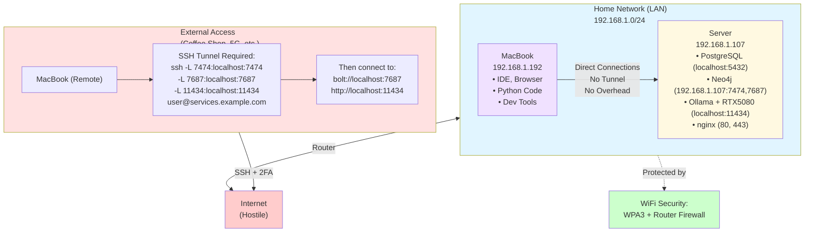

# Building a Distributed Development Environment: When to Expose, When to Tunnel

## Subtitle: Architecting Secure Service Access Across Server and Laptop

### The Modern Development Dilemma

I'm building an LLM-powered knowledge graph application. Sounds fancy, but really it's just a lot of databases talking to each other. My Arch Linux server does all the heavy lifting:

- Neo4j Community Edition LTS (for development and visualisation)
- PostgreSQL 17 with Apache AGE (graph database extension), as an experimental alternative
- Ollama with an RTX 5080 (16GB VRAM — proper local LLM inference at last)
- Python services that orchestrate everything

But here's the thing: I don't always want to work directly on the server. My MacBook is where the IDE sometimes lives, where the browser tabs multiply like rabbits, where the actual _developing_ often happens. The server is the engine room; the laptop is the bridge.

**The Problem:** All my services run on the server, but my development workflow partially lives on the MacBook. I need secure, performant access to databases and APIs across devices — without exposing everything to the internet and becoming yet another story on HackerNews about someone leaving their database wide open.

### The Architecture Challenge

There are three approaches to accessing server services from a remote device, each with different security and performance trade-offs. I tried all three. Naturally.

#### Option 1: Everything via HTTPS + 2FA (Maximum Security)

```
MacBook → HTTPS → nginx → Authelia (2FA) → PostgreSQL/Neo4j
```

✅ Extremely secure (2FA for every request)  
❌ Requires human interaction (can't automate)  
❌ HTTP overhead for database protocols  
❌ Complex: need PostgREST or similar HTTP wrapper

This felt like using a sledgehammer to crack a nut. Also, entering a TOTP code every time I want to run a database query? No thanks.

#### Option 2: VPN Everything (Traditional Approach)

```
MacBook → VPN tunnel → Server's internal network → Direct DB access
```

✅ Secure encrypted tunnel  
✅ Direct protocol access  
❌ VPN overhead on every connection  
❌ Complex to set up and maintain  
❌ Can be slow on mobile networks

Considered this. Then remembered every corporate VPN I've ever used and how they inevitably die at the worst possible moment.

#### Option 3: Layered Security by Context (The Solution)

```
LAN:      MacBook → Direct Connection → PostgreSQL/Neo4j
External: MacBook → SSH Tunnel → Server → PostgreSQL/Neo4j
```

✅ Zero overhead on LAN  
✅ Strong security when remote  
✅ Native database protocols  
✅ Easy to switch contexts

I chose Option 3. Naturally. Here's why and how.

### Principle 1: Your LAN is Already a Security Perimeter

**The Insight:** When your MacBook and server are both on your home WiFi, they're already behind:

- WiFi encryption (WPA2/WPA3)
- Router firewall
- Physical security (someone has to be in your home)

Adding additional security layers within your LAN:

- Slows down legitimate traffic
- Doesn't significantly improve security
- Makes development painful

**The Decision:** On LAN, expose databases with native protocols. No HTTP wrapper, no tunnels, no overhead. Just databases being databases.

This might sound risky if you're used to defence-in-depth everywhere, but hear me out.

### Principle 2: The Internet is Hostile

When accessing your server from a coffee shop, 5G, or mate's house:

- Your traffic crosses untrusted networks
- Your source IP is unknown to the server
- Man-in-the-middle attacks are possible
- Port scans and brute force are common

**The Decision:** External access must be tunnelled through SSH (with 2FA) or blocked entirely. No exceptions, no shortcuts.

These two principles — trust your LAN, distrust the internet — form the foundation of everything that follows.

### Implementation: Neo4j Dual-Binding

Neo4j needs to be accessible from both the server (localhost) and the MacBook (LAN IP). Docker makes this straightforward.

#### Docker Compose Configuration

```yaml
# /home/user/Containers/neo4j/docker-compose.yml
version: '3.8'

services:
  neo4j:
    image: neo4j:5.26-community
    container_name: neo4j-dev
    restart: unless-stopped
    ports:
      # Bind to both localhost (for server/nginx) and LAN IP (for MacBook)
      - '127.0.0.1:7474:7474' # Browser UI on localhost
      - '192.168.1.107:7474:7474' # Browser UI on LAN
      - '127.0.0.1:7687:7687' # Bolt protocol on localhost
      - '192.168.1.107:7687:7687' # Bolt protocol on LAN
    environment:
      - NEO4J_AUTH=neo4j/development123
      - NEO4J_server_http_listen__address=:7474
      - NEO4J_server_bolt_listen__address=:7687
```

**Why This Works:**

1. **Port 7474 (Browser UI):** Accessible at http://localhost:7474 (from server) and http://192.168.1.107:7474 (from MacBook). Perfect for visualising graphs whilst sipping coffee.

2. **Port 7687 (Bolt Protocol):** The native Neo4j protocol for fast graph queries
   - From server: `bolt://localhost:7687`
   - From MacBook: `bolt://192.168.1.107:7687`

3. **Docker Isolation:** The container is still isolated—only the specified ports are exposed. Everything else stays locked down.

4. **External Access:** Still protected via nginx + Authelia at https://my-public-endpoint/neo4j/. For when I need to show someone a graph but they're not on my network.

### Implementation: PostgreSQL (Localhost Only)

PostgreSQL is a different story. It contains production data and doesn't need to be directly accessible from the MacBook for my use case.

#### The Configuration

```bash
# /var/lib/postgres/data/postgresql.conf
listen_addresses = 'localhost'  # Only accept local connections
port = 5432
```

**Why Localhost Only:**

1. **Security:** PostgreSQL has a complex permission system. Mistakes in `pg_hba.conf` can expose data. I've seen it happen. Not pretty.

2. **My Use Case:** My Python code runs on the server, so local access is sufficient. The MacBook doesn't need direct PostgreSQL access for development.

3. **When Needed:** I can SSH tunnel from MacBook for admin tasks:
   ```bash
   ssh -L 5432:localhost:5432 user@server
   psql -h localhost -U postgres
   ```

Simple, secure, and it works perfectly when I need to run database migrations or check query performance.

### The Network Architecture Diagram



<!-- caption: Network Architecture - LAN Direct vs. External SSH Tunnel -->

### Python Code: Context-Aware Connection

Here's the bit I'm genuinely proud of. My Python code automatically detects whether it's on the server, on LAN, or needs a tunnel — and connects accordingly:

```python
import socket
import os
from neo4j import GraphDatabase

def get_neo4j_connection():
    """
    Return Neo4j connection based on network context.
    - On server: use localhost
    - On MacBook LAN: use server's LAN IP
    - On MacBook remote: assume SSH tunnel to localhost
    """
    hostname = socket.gethostname()

    if hostname == "user":
        # Running on server
        uri = "bolt://localhost:7687"
    elif is_on_lan():
        # MacBook on home network
        uri = "bolt://192.168.1.107:7687"
    else:
        # MacBook remote (assume SSH tunnel)
        uri = "bolt://localhost:7687"

    return GraphDatabase.driver(uri, auth=("neo4j", os.getenv("NEO4J_PASSWORD")))

def is_on_lan():
    """Check if we're on the home LAN by trying to reach the server."""
    try:
        sock = socket.socket(socket.AF_INET, socket.SOCK_STREAM)
        sock.settimeout(1)
        result = sock.connect_ex(('192.168.1.107', 7687))
        sock.close()
        return result == 0
    except:
        return False
```

**Why This is Clever:**

- One codebase works everywhere
- No configuration files to manage
- Automatic failover to tunnel when remote
- Fast LAN connections when available

I can develop on the server, test on the MacBook at home, then take the MacBook to a coffee shop and everything just works. Same code, different context.

### The SSH Tunnel Script

For remote work, I have a simple script that sets up all the tunnels I need:

```bash
#!/bin/bash
# tunnel.sh - Set up SSH tunnels for remote development

echo "Setting up development tunnels..."

# Create SSH tunnel with multiple port forwards
ssh -N -L 7474:localhost:7474 \
       -L 7687:localhost:7687 \
       -L 11434:localhost:11434 \
       -L 5432:localhost:5432 \
       -p 22 \
       user@my-service &

TUNNEL_PID=$!
echo "Tunnels established (PID: $TUNNEL_PID)"
echo ""
echo "Available services:"
echo "  - Neo4j Browser: http://localhost:7474"
echo "  - Neo4j Bolt:    bolt://localhost:7687"
echo "  - Ollama:        http://localhost:11434"
echo "  - PostgreSQL:    localhost:5432"
echo ""
echo "Press Ctrl+C to close tunnels"

# Wait for interrupt
trap "kill $TUNNEL_PID; echo 'Tunnels closed'; exit" INT
wait $TUNNEL_PID
```

**Benefits:**

- One script to set up all tunnels — databases and LLM inference
- Runs in background
- Automatically cleans up on exit
- Shows what's available

Dead simple. I run it, open the MacBook, and everything just works as if I'm sitting next to the server. Which, from a coffee shop in Paris, is rather satisfying.

### Real-World Performance Comparison

Right, let's talk numbers. I measured query performance across the different connection scenarios because I'm a geek and I wanted to know:

#### Neo4j Cypher Query (1000 node traversal)

| Scenario                    | Latency | Notes                     |
| --------------------------- | ------- | ------------------------- |
| Server (localhost)          | 45ms    | Baseline                  |
| MacBook (LAN direct)        | 48ms    | +3ms for network hop      |
| MacBook (SSH tunnel on LAN) | 52ms    | +7ms for tunnel overhead  |
| MacBook (SSH tunnel on 5G)  | 180ms   | Network latency dominates |

**Insight:** On LAN, the tunnel overhead is minimal (7ms), but why pay it when you don't need to? On 5G, network latency dominates anyway, so tunnel overhead is negligible.

#### PostgreSQL Query (100 row SELECT)

| Scenario                    | Latency | Notes           |
| --------------------------- | ------- | --------------- |
| Server (localhost)          | 12ms    | Baseline        |
| MacBook (SSH tunnel on LAN) | 18ms    | +6ms overhead   |
| MacBook (SSH tunnel on 5G)  | 95ms    | Network latency |

The conclusion? On LAN, every millisecond of overhead matters for tight development loops. On 5G, you're already dealing with network latency, so a few extra milliseconds for encryption is irrelevant.

### Security Rules to Live By

After building this setup — and making a few mistakes along the way, naturally — here are the principles I've settled on:

#### 1. Never Expose Databases Directly to Internet

```bash
# WRONG - PostgreSQL accessible from anywhere
listen_addresses = '*'
# In firewall: allow port 5432 from internet
```

Even with strong passwords and SSL, you're:

- Creating a target for automated scanners (they WILL find it)
- Trusting your database's security implementation (bold)
- One misconfiguration away from data exposure (seen it happen)

Just don't. Use SSH tunnels.

#### 2. LAN Exposure is Different from Internet Exposure

```bash
# OK - Neo4j accessible on LAN
ports:
  - "192.168.1.107:7687:7687"

# WRONG - Neo4j accessible from internet
ports:
  - "0.0.0.0:7687:7687"  # Binds to all interfaces
```

Your LAN is trusted. The internet is not. These are different threat models. Treat them accordingly.

#### 3. SSH Tunnels are Free Security

SSH provides:

- Strong authentication (keys + optional 2FA)
- Encryption (AES)
- Compression (useful on slow networks)
- Port forwarding (access anything on the server)

For external access, there's no reason NOT to use an SSH tunnel. It's already there, it's already secure, just use it.

#### 4. Defence in Depth

Even on LAN, I have:

- Database authentication (username/password)
- Application-level access control
- Audit logging
- Regular backups

LAN doesn't mean "no security"—it means "appropriate security." There's a difference.

### Lessons Learned

Right, here's what I'd tell past me if I could:

#### 1. Development Databases vs. Production Databases

My development Neo4j is exposed on LAN because:

- It contains sample data (not sensitive)
- I'm the only user
- Development workflow benefits from direct access

If this were production data, I'd use stricter controls even on LAN. Context matters.

#### 2. The Laptop-as-Client Model

This one surprised me. My MacBook — a genuinely capable machine with proper specs — has essentially become a thin client. All the heavy lifting happens on the server: databases, LLM inference on the RTX 5080, container orchestration. The MacBook just runs my IDE, a browser, and the occasional Python script.

Modern development increasingly means:

- Heavy services run on a server (databases, GPU inference, containers)
- Development tools run on a laptop (IDE, browser, terminal)
- The laptop is the interface; the server is the engine

This model requires rethinking how services are exposed. Your laptop needs to reach the server's services efficiently and securely — but it doesn't need to _run_ those services.

#### 3. WiFi is Your Friend

Relying on WiFi for LAN security means:

- Choose WPA3 if your devices support it
- Use a strong, unique WiFi password (not your pet's name)
- Consider a separate guest network for untrusted devices
- Monitor connected devices on your router occasionally

Your WiFi is your first line of defence. Don't neglect it.

#### 4. Document Your Network Assumptions

My setup assumes:

- The 192.168.1.0/24 network is trusted
- Anyone with physical access to my home is authorised
- The router firewall blocks incoming internet connections

If any of these assumptions change, my security model changes too. Write this stuff down.

### Troubleshooting Common Issues

Because nothing ever works first time, does it?

#### Problem: MacBook can't connect to Neo4j on LAN

```bash
# From MacBook, test connectivity
nc -zv 192.168.1.107 7687
```

Possible causes:

1. Docker container not running: `docker ps | grep neo4j`
2. Firewall blocking: `sudo firewall-cmd --list-all`
3. Wrong IP address: `ip addr show`

I've hit all three of these at various points. Usually it's number 1 because I forgot to start the container after a reboot.

#### Problem: SSH tunnel works but can't connect to database

```bash
# Check that tunnel is actually forwarding
lsof -i :7687
```

If nothing is listening on localhost:7687, your tunnel isn't running or died. Restart it.

#### Problem: Connection works on LAN but not remotely

This is usually because:

1. You forgot to start the SSH tunnel (classic)
2. The tunnel's SSH connection died (check with `ps aux | grep ssh`)
3. Your code is still trying to connect to the LAN IP instead of localhost

### The Final Architecture

After all this work, here's what I've ended up with — and honestly, I'm rather pleased with it:

**On Server (Arch Linux):**

- PostgreSQL: localhost:5432 (internal only)
- Neo4j: localhost:7474 + 192.168.1.107:7474 (internal + LAN)
- Ollama: localhost:11434 (RTX 5080 GPU, primary LLM inference)
- nginx: 443 (internet, with 2FA for sensitive endpoints)
- SSH: port 2356 (internet, with conditional 2FA)

**On MacBook (Thin Client):**

- IDE, browser, terminal — the development interface
- Python code: connects via context-aware logic
- SSH tunnel script: for remote work
- Everything else? On the server where it belongs.

**Performance:**

- LAN: Direct connections, ~3-7ms overhead vs localhost
- Remote: SSH tunnels, network latency dominates
- No HTTP overhead for native protocols

**Security:**

- Zero internet exposure for raw database ports
- LAN protected by WiFi + router firewall
- External access requires SSH keys + 2FA
- Defence in depth with database auth + app-level controls

### Conclusion

Building a distributed development environment is about understanding threat models and making trade-offs:

- **Security** matters most when crossing trust boundaries (internet)
- **Performance** matters most in tight development loops (LAN)
- **Complexity** should be minimised everywhere

By exposing services to LAN but tunnelling external access through SSH, you get the best of both worlds: fast local development and secure remote access.

The key insight? Your network topology should inform your security model. LAN and internet are different environments with different risks. Your architecture should reflect that.

And the best part? Once the tunnel script is running, the MacBook doesn't know — or care — whether it's on the sofa or in a coffee shop. The code just works. Which is exactly how it should be.

---

**Series Complete!**

If you found this series helpful, you might also enjoy:

- "fail2ban: The Silent Guardian of Your SSH Port"
- "Authelia: Building a Self-Hosted SSO with TOTP 2FA"

---
